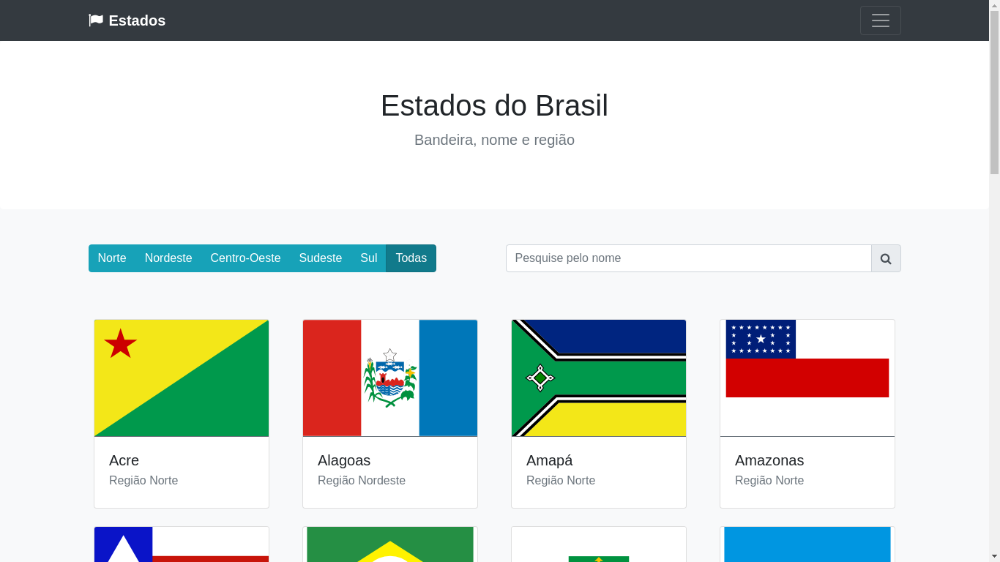

<h1 align="center">Galeria de fotos</h1>

<p>Projeto realizado durante o curso de Web Moderno com o professor Leonardo Moura Leitão.
Ele consiste em uma galeria de fotos com botões para filtragem.</p>

<p>A partir do projeto base, as fotos foram trocadas por cards das bandeiras do Brasil, com a foto da bandeira, nome do estado e região. Elas são chamadas de um arquivo json via ajax. Já a filtragem é feita de duas formas diferentes: por botões para filtrar a região e por input para filtrar as cidades.</p>

## Tecnologias
As seguintes ferramentas foram tilizadas na construção do projeto:


## Screen Shots



## Como rodar a aplicação

Para o download do projeto, siga as intruções abaixo:

```
1. git clone https://github.com/mateusgs29/galeria-estados.git
2. cd galeria-estados
```

Instale as dependências e inicie o projeto:

```
1. yarn install
2. yarn start
```

ou

```
3. npm install
4. npm start
```

Para construir o projeto com webpack:

```
1. npm run build
```

ou 

```
2. yarn run build
```
